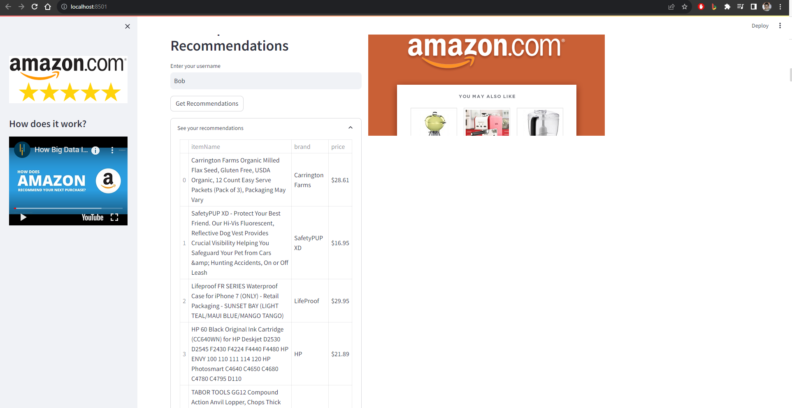
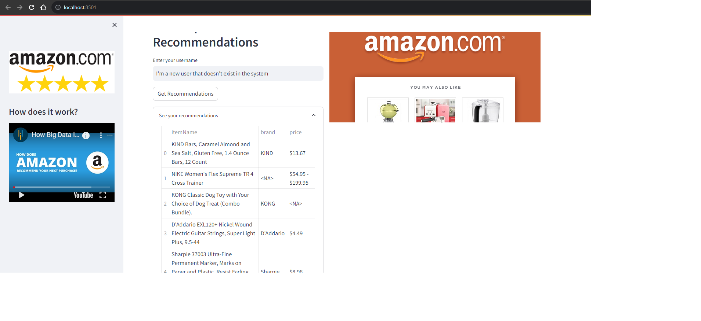

# Amazon product recommendation app

Amazon product recommendation app is an app for predicting 5 recommended items for a given user. The engine behind the app is an ML model that has learned the users prior activities on Amazon: items rated, similar users activity, item ratings by other users.

## Research

The [Amazon product ratings prediction.ipynb](./Amazon%20product%20ratings%20prediction.ipynb)
notebook contains the research and analysis conducted for the Amazon Recommendation System project. It encompasses data exploration, preprocessing, model building, and evaluation. The notebook outlines the methodology behind the recommendation engine and discusses the results and insights gained from the data.

The only dataset needed for the project is the [amazon_reviews.csv](https://github.com/dormeir999/Amazon-Recommendation-System/blob/main/amazon_reviews.csv), and it can also be downloaded directly from [kaggle](https://www.kaggle.com/datasets/rogate16/amazon-reviews-2018-full-dataset?resource=download).

The rest of the datasets are just the byproducts and outputs of this dataset and the Jupyter notebook commands and `src` scripts.

After running all cells in the notebook one by one, all relevant datasets will be created and the streamlit app can run correctly.

## Installation

Use the package manager [pip](https://pip.pypa.io/en/stable/) to install streamlit.

```bash
pip install streamlit pandas numpy
```

## Usage

### Python
```bash
streamlit run ./src/amazon_recommendation_app.py
```
### Windoes
Just run this: [run_app.bat](src%2Frun_app.bat)



## Contributing

Pull requests are welcome. For major changes, please open an issue first
to discuss what you would like to change.

Please make sure to update tests as appropriate.

## License

[MIT](https://choosealicense.com/licenses/mit/)

## Contacts

dor.meir999@gmail.com

https://www.linkedin.com/in/dor-meir/
